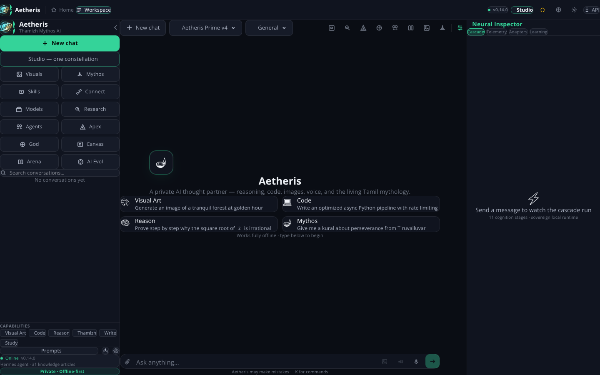
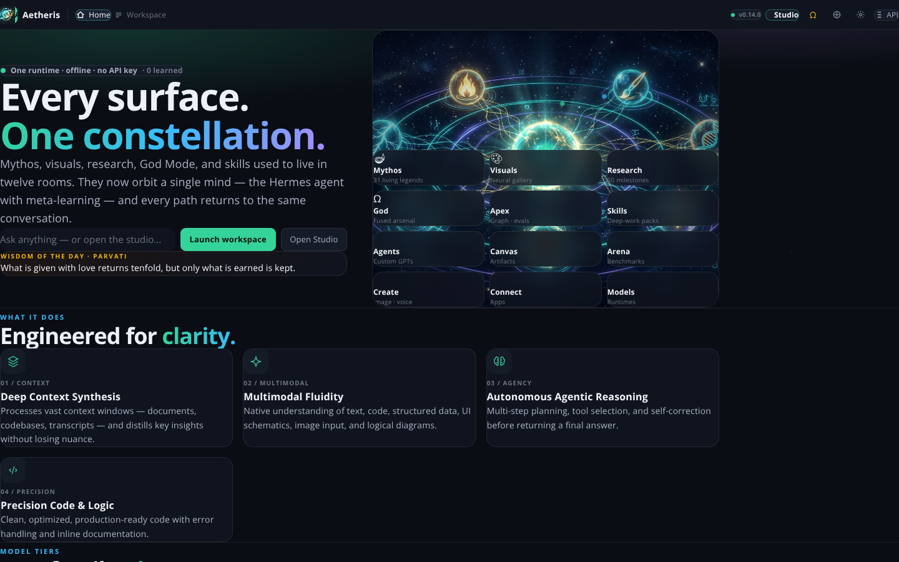

# Æ Aetheris

> *Where Raw Intellect Meets Human Intuition.*

**Aetheris** (pronounced *ay-THER-iss*) is a next-generation AI thought partner
designed for deep reasoning, creative synthesis, and technical precision. Powered
by multimodal intelligence and agentic problem-solving, Aetheris effortlessly
writes clean code, analyzes complex data, and refines ideas—delivering clear,
actionable intelligence for any workflow.

This repository is **one application**: a FastAPI backend and a Next.js web UI
that ship and run as a single process, both driven by one brain — the
**Hermes agent with meta-learning** — which runs **entirely offline**. No API
key, no vendor API, no model weights, no network.

---

## One app, one brain

Everything runs through a single cascade. There is no second engine, no
browser-side copy of the logic, and no disconnected subsystem:

```
                        ┌──────────────────────────────┐
  Browser UI  ──────────►  FastAPI (one process, :8000) │
  (served at /)         │                              │
                        │   /v1/hermes/*   /v1/chat/*  │
                        └───────────────┬──────────────┘
                                        │
                              ┌─────────▼─────────┐
                              │   HERMES AGENT    │
                              └─────────┬─────────┘
   perceive → classify → adapt → deliberate → ground → route → recall
            → act → synthesize → polish → learn
                          │                        │
                   (meta-learning in)      (meta-learning out)
```

| Stage | What actually happens |
|-------|----------------------|
| `perceive` | Tokenization, language/script detection, entities, sentiment, keywords |
| `classify` | Intent via cue regexes + TF-IDF cosine over 40 intent prototypes |
| `adapt` | **Meta-learning inner loop** — few-shot exemplars, intent priors, tool priors, fast-adapted strategy |
| `deliberate` | Exact symbolic computation: recursive-descent parser, conversions, percentages, quadratics, statistics |
| `ground` | BM25 over a 31-article built-in corpus, mounted documents, **and** the knowledge graph |
| `route` | NOVA sparse mixture-of-experts routing |
| `recall` | NOVA hierarchical long-term memory |
| `act` | **Real tool execution** — sandboxed Python, retrieval, media synthesis |
| `synthesize` | Composes the answer, shaped by the learned strategy |
| `polish` | Safety gating, vendor-voice stripping, honesty enforcement |
| `learn` | **Meta-learning outer loop** — records the episode and updates the learner |

### The two pillars are live, not planned

`Hermes Agent + Meta-Learning` used to be a string in a spec file. Both pillars
are now executing code you can call:

* **Hermes Agent** ([`aetheris/hermes/agent.py`](aetheris/hermes/agent.py)) —
  plan → act → observe → self-correct against the real toolbelt, every stage
  traced. `POST /v1/hermes/run`
* **Meta-Learning** ([`aetheris/hermes/meta_learning.py`](aetheris/hermes/meta_learning.py)) —
  Dirichlet intent priors, per-intent tool priors, trigram-nearest few-shot
  exemplar recall, and a Reptile-style online strategy update, all learned from
  the agent's own episodes. `GET /v1/hermes/meta`

Learning is observable. Ask something, rate the answer 👍/👎, and watch the
strategy, priors, and exemplar store move in the Inspector's **learning** tab —
or at `GET /v1/hermes/meta`. `GET /v1/training` reports this as live telemetry
rather than a declared intention.

### Offline by construction

The default provider is the local Hermes agent. With every socket and DNS call
blocked, arithmetic, retrieval, code execution, and generation all still work.
Point `AETHERIS_LLM_PROVIDER=openai` at an upstream model if you want one — the
Hermes runtime stays available at `/v1/hermes/*` either way.

---

## Highlights

- **OpenAI-compatible API** — `POST /v1/chat/completions` with streaming (SSE) and
  non-streaming responses. Point any existing OpenAI client at Aetheris.
- **Aetheris `mode` extension** — one field selects a classic, legend, tempo, or
  gated identity: `general`, `engineering`, `editorial`, `structured`, `myth`,
  `legendary`, `thamizh`, `pro`, `lite`, `flash`, or opt-in `sovereign`.
- **Model-tier registry** — `aetheris-lite` (Flash), `aetheris-pro`, and
  `aetheris-ultra` (Reasoning Engine), addressable by id or alias.
- **Production system-prompt suite** — official prompts for every mode, injected
  automatically so the Aetheris persona is always active.
- **Provider abstraction** — runs out-of-the-box on the offline **Hermes** agent;
  switch to any OpenAI-compatible endpoint (OpenAI, Groq, Together, vLLM, Ollama,
  LM Studio) via environment variables.
- **Typed everywhere** — Pydantic v2 schemas, Python 3.11+ idioms, defensive error
  handling.
- **One integrated web application** at `/` — a single shell with a **Home**
  view (constellation hero, capabilities, model tiers, inference modes, visual studio,
  architecture, training, research hub, and copy-ready API examples), a
  **Workspace** view (threaded chat, eleven-stage cascade Inspector, live
  meta-learning dashboard, 👍/👎 reinforcement, file attachment, command
  palette, and prompt library), and one **Studio** that folds mythos, visuals,
  create, research, God Mode, Apex, skills, agents, canvas, arena, integrations,
  and model runtimes into a single chamber (`⌘⇧S`).
  Served by the Python process itself — no second surface, no separate frontend server.
- **God Mode orchestration** — activate an expert control deck with sampling
  controls, mission profiles, local context-file mounting, execution telemetry,
  a three-agent Council workflow, a Lite-vs-Pro-vs-Ultra Model Arena, sequential
  Flow Forge recipes, intent-aware Smart Routing, persistent workspaces, live
  session analytics, cancellable runs, voice input, response refinement actions,
  session export, and a `⌘/Ctrl+K` command center.
- **Local Operations Dock** — inspect sanitized API payload previews, validate
  structured JSON responses, export response artifacts, create restorable
  workspace checkpoints, and manage a reusable local Prompt Vault.
- **Executable capabilities, not claims** — the blueprint's agentic promises are
  implemented and running:
  - **Code sandbox** — real Python execution in an isolated subprocess with CPU,
    memory, wall-clock, and network limits.
  - **Deep document search (RAG)** — dependency-free BM25 retrieval over
    chunked documents, with automatic grounding for plain chat.
  - **Autonomous agent loop** — plan → call tools → observe → self-correct,
    bounded and fully traced.
  - **Multimodal input** — OpenAI-style `image_url` content parts.
  - **Tool calling** — the full OpenAI `tools` contract, forwarded upstream or
    executed in-process.
  - **Sovereign mode** — an opt-in unrestricted expert identity.
- **Creation, not just conversation** — Aetheris produces real files, encoded
  in-process with the standard library alone (no Pillow, no ffmpeg, no GPU, no
  API key):
  - **Images** — *layered* generation: deterministic procedural PNG synthesis
    offline by default, upgraded to a real generative model (**NVIDIA NIM/FLUX,
    OpenAI DALL-E/gpt-image, Google Imagen 3, or Stability**) whenever a matching
    API key is configured.
  - **Video** — NVIDIA Cosmos NIM MP4 generation when configured, with looping
    procedural GIFs as the no-key/offline fallback.
  - **Audio** — 16-bit WAV melodies, chord progressions, tones, **and offline
    text-to-speech** (a formant synthesizer) with provider voices on demand.
  - **Code** — projects scaffolded as runnable ZIPs, and snippets *executed*
    to prove they work before you are shown them.
- **Multi-provider chat** — alongside the offline Hermes agent and the
  OpenAI-compatible provider, Aetheris ships first-class **Anthropic Claude**,
  **Google Gemini**, and **NVIDIA NIM** providers. NVIDIA NIM is fused with the
  existing Hermes adapter: task strategy is adapted before inference, normal
  tools execute through Hermes, and completed episodes update the shared
  meta-learner afterward.
- **Voice endpoints** — `POST /v1/audio/speech` (text-to-speech, offline by
  default) and `POST /v1/audio/transcriptions` (speech-to-text via Whisper or
  Gemini when a key is set; an honest "not available offline" otherwise).
- **Thamizh Mythos mode** — a mythology AI by a Tamil developer: the `thamizh`
  inference mode speaks in the cadence of the Sangam poets and Tiruvalluvar's
  kuṟaḷ (short, exact, resonant), while keeping every fact and number intact.
- **Skills catalog** — `GET /v1/skills/catalog` lists browsable **Claude-style**
  (artifacts, canvas, code review, projects) and **Gemini-style** (deep
  research, vision, gems, multimodal synthesis) skill packs, each mapped to the
  live toolbelt.
- **Open-source resources** — `GET /v1/resources` is a curated catalog of local
  runtimes (Ollama, LM Studio, vLLM, LiteLLM), hosted open-weight APIs (Groq,
  Together, DeepSeek, Mistral, OpenRouter), and model families to plug in with
  one `.env` change.
- **More integrations** — Gmail, Google Meet, Google Calendar, Google Drive,
  Google Sheets, Telegram, WhatsApp, LinkedIn, Instagram, YouTube — added to the
  existing Slack / GitHub / Discord / Notion / Jira / Stripe / SendGrid / Twilio
  templates.
- **ChatGPT-style UI** — a chat shell with a visible input toolbar for every
  form: text, voice (speech-to-text), speech (text-to-speech read-aloud),
  image generation, and attachments, plus one-click Skills / Connect / Models
  panels.
- **Living Tamil Mythology** — a connected pantheon of 31 legendary figures
  (gods, goddesses, heroes, sages, kings, villains, asuras, and divine
  symbols) that you can summon and speak with, from Murugan to Ravana:
  - `GET /v1/mythology` — browse the pantheon by category.
  - `POST /v1/mythology/chat` — summon a figure and talk to them; each answers
    in its own voice (a god's clarity, a sage's kural, a villain's warning).
  - `POST /v1/mythology/{id}/portrait` — generate a figure's portrait via the
    layered image provider.
  - A dedicated **Mythos** panel in the UI (sidebar + top bar) brings every
    character to life with a live conversation and a "summon their form"
    portrait button.
  - **One connected pantheon** — `GET /v1/mythology/graph` returns all 31
    figures as a single web of family, fate, and battle (e.g. Murugan is the
    son of Shiva & Parvati, wields the Vel, and slew Surapadman & Tarakasuran).
    Selecting a figure shows its connections in the UI.
  - **Layered living voices** — `POST /v1/mythology/chat` hands the figure's
    full persona to a real model (OpenAI / Anthropic / Gemini) when an API key
    is configured for vivid roleplay, and falls back to the offline in-character
    responder otherwise — so nothing is ever disconnected and no key is required.
  - **Expanded cast** — now 31 legends including the goddess **Meenakshi**,
    folk guardians **Madurai Veeran** & **Karuppu Sami**, and the Nayanmar
    poet-saints **Sambandar** & **Appar**.
  - **Legend Council** — `POST /v1/mythology/council` convenes 2–4 legends to
    advise together on a single question; each speaks in its own voice and a
    synthesis joins their counsel.
  - **Wisdom of the Day** — `GET /v1/mythology/daily` returns a rotating figure
    plus kural-sized counsel, stable for the whole calendar day.
  - **Custom Legend Creator** — `POST /v1/mythology/custom` lets you invent your
    own figure (name, epithet, domain, symbol, persona, summoning line). Custom
    legends join the pantheon and can be summoned, portrayed, and counseled.
  - **Character memory** — mythos chat is now per-session: each legend remembers
    your recent exchange, so a conversation flows naturally rather than starting
    fresh every turn.
- **Smart model routing** — `POST /v1/models/recommend` scores every tier for a
  task (reasoning, math, code, research, latency, context length) and picks the
  best fit with the reasons behind it, before a request hits the provider.
- **Conversation summarizer** — `POST /v1/conversations/{id}/summarize` runs the
  Hermes agent over a stored transcript and returns a structured recap
  (summary, key points, action items), with a deterministic extractive fallback.
- **Seeded release notes** — `/v1/changelog` is populated with the current
  release's feature/fix entries on first boot.
- **Apex cognition (v0.12)** — a second intelligence layer on top of Hermes:
  - **Knowledge graph** — entity-relation Graph RAG with multi-hop traversal.
  - **Constitution** — named principles that critique, revise, or refuse an answer.
  - **Eval harness** — deterministic graders, a live `hermes-cognition` suite, A/B scorecards.
  - **Provenance** — sentence-level citation graphs for every generation.
  - **Circuit breakers** — closed / open / half-open isolation around tools.
  - **Skills** — composable instruction packs matched per turn.
  - **Semantic cache** — near-duplicate prompt reuse via signature embeddings.
  - **Guardrails** — JSON Schema contracts with automatic repair.
- **Legend modes (v0.13)** — `myth`, `legendary`, `pro`, `lite`, and `flash`
  restyle answers on **every** model (Flash v2 · Prime v4 · Omni Reasoner).
  Distinct from the Pro/Lite/Flash *tiers*. Aliases: `little`, `mythic`,
  `legend`, `quick`. `GET /v1/legends` returns the full pairing matrix.
- **God Mode (v0.13)** — a fused ultra-reasoning arsenal, all offline and deterministic:
  - **Tree-of-Thought MCTS** — UCB1 search over competing thoughts (formal, adversarial, causal, …).
  - **Causal world model** — signed DAG with `do(X)` interventions and counterfactuals.
  - **Bayesian hypotheses** — competing explanations, posteriors, a falsifier for the leader.
  - **Proof kernel** — natural-deduction checker (modus ponens, ∧/∨, →-intro, explosion).
  - **Red-team battery** — 10 constitution probes scored on the *first* critique verdict.
  - **Calibrated forecasts** — log a probability, resolve it, read Brier + 10 calibration buckets.
  - **Meta-controller** — `POST /v1/god/run` classifies the task and fuses the right engines.
  - **God Deck UI** — Ω in the sidebar / header, or `⌘K` → God Deck (`⌘⇧G` to toggle).

---

## Advanced feature atlas

Aetheris is larger than its chat endpoint. The current API exposes roughly
**400 operations across more than 80 `/v1` route families**. This atlas groups
the implementation by capability so the less-visible platform features are as
discoverable as chat, Hermes, and Studio. For the exact request/response schemas
on a running instance, open [`/docs`](http://localhost:8000/docs) or
[`/openapi.json`](http://localhost:8000/openapi.json).

### Read the status labels first

The repository deliberately mixes executable local engines, optional provider
adapters, and architecture experiments. These labels keep the distinction clear:

| Label | Meaning |
|-------|---------|
| **Local / live** | Executes in this Python process with no external model or API key. |
| **Layered** | Has a local fallback and upgrades to a configured remote provider. |
| **Opt-in** | Reaches an external system or relaxes a default boundary, so an operator must enable/configure it. |
| **Simulation / scaffold** | A deterministic architecture experiment, typed protocol, or emulated action surface—not bundled model weights or control of a real desktop. |

Most registries, histories, canvases, memories, and generated artifacts are
**bounded process-local stores** unless an endpoint explicitly exports them.
They survive requests in the running process, but not a server restart. Hermes
meta-learning is the exception when `AETHERIS_HERMES_META_STATE_PATH` is set;
portable workspace bundles are available through `/v1/export` and `/v1/import`.

### Complete capability map

| Area | Advanced features implemented in the repository | Primary API surface |
|------|-------------------------------------------------|---------------------|
| **OpenAI-compatible inference** | Streaming SSE, non-streaming completions, model tiers, mode aliases, multimodal `image_url` parts, caller-supplied tools, automatic toolbelt exposure, parallel batch completions, smart tier recommendation | `/v1/chat/*`, `/v1/models*`, `/v1/modes`, `/v1/legends`, `/v1/batch/completions` |
| **Hermes cognition + learning** | Eleven traced stages, symbolic deliberation, BM25 grounding, sparse routing, memory recall, bounded tool use, self-correction, few-shot exemplars, intent/tool priors, explicit reinforcement, optional learned-state persistence | `/v1/hermes/*`, `/v1/training` |
| **NOVA cognition** | Effort-controlled deliberation, eight-expert routing, council/debate/pipeline/swarm orchestration, three-tier memory, deep research, versioned canvases, executable DAG plans, confirmation-gated computer-use sessions | `/v1/nova/*` |
| **Apex cognition** | Entity-relation Graph RAG, constitutional critique/revision, deterministic eval suites and A/B runs, sentence-level provenance graphs, circuit breakers, composable skills, semantic cache, JSON contract repair | `/v1/apex`, `/v1/graph/*`, `/v1/constitution/*`, `/v1/evals/*`, `/v1/provenance/*`, `/v1/breakers/*`, `/v1/skills/*`, `/v1/semantic-cache/*`, `/v1/guardrails/*` |
| **God Mode** | Tree-of-Thought UCB1 search, causal interventions and counterfactuals, Bayesian hypothesis ranking, natural-deduction proof checking, constitution red-team probes, probability forecasts and Brier calibration | `/v1/god/*` |
| **Research engines** | Offline executable catalog of 50 AI milestones, era timeline, parameterized algorithm runs, cross-era benchmarks and synthesis; separate NOVA corpus research and a report-oriented research simulation | `/v1/research/*`, `/v1/nova/research` |
| **Neural architecture lab** | Five model specifications, deterministic synthesis, LoRA adapter state, Paged-KV/prefix-cache telemetry, speculative-decoding telemetry, MLA, fine-grained MoE, MTP and virtual NIAH experiments, Ollama/Hugging Face exports | `/v1/neural/*` |
| **Knowledge and retrieval** | Chunked BM25 RAG, automatic chat grounding, deterministic signature embeddings and vector search, three-tier associative memory, graph ingestion/path/inference, semantic response matching | `/v1/documents/*`, `/v1/embeddings/*`, `/v1/nova/memory/*`, `/v1/graph/*`, `/v1/semantic-cache/*` |
| **Agents and tool execution** | OpenAI tool schemas, direct invocation, autonomous tool loop, sandboxed Python, reusable skills, six built-in specialist agents, custom private agents, plan-then-execute DAGs, audited action staging | `/v1/tools/*`, `/v1/agents/*`, `/v1/nova/plan`, `/v1/computer-use/*` |
| **Code engineering** | Verified Python snippets, four project scaffold types, plan → write → test → repair coder, NVIDIA-assisted source generation, ZIP artifacts, GitHub repository creation/push/PR flow | `/v1/code/*`, `/v1/github/*` |
| **Multimedia Studio** | Layered image/video/voice providers; procedural image and GIF engines; image edits/upscale/QR/remix/collage/charts; songs, ambient audio, podcasts, speech; slideshows and audio visualizers | `/v1/images/*`, `/v1/videos/*`, `/v1/audio/*`, `/v1/artifacts/*` |
| **Mythos** | Connected Tamil pantheon, character personas and memory, daily wisdom, multi-character councils, custom legends, layered roleplay, generated portraits, Thamizh inference mode | `/v1/mythology/*`, `mode=thamizh` |
| **Automation** | Credential-safe connections, authenticated proxy requests, typed workflows, conditions/loops/parallel branches/retries, manual/event/cron/webhook triggers, scheduler, event bus, 21 integration templates | `/v1/connections/*`, `/v1/workflows/*`, `/v1/schedules/*`, `/v1/scheduler/*`, `/v1/events/*`, `/v1/integrations/*` |
| **Workspace and content** | Searchable conversation threads, structured summaries, prompt templates, response cache, file storage with text auto-indexing, presets, bookmarks, notifications, global search, snapshots/diffs/rollback, export/import | `/v1/conversations/*`, `/v1/prompts/*`, `/v1/cache`, `/v1/files/*`, `/v1/presets/*`, `/v1/bookmarks/*`, `/v1/notifications/*`, `/v1/search`, `/v1/snapshots/*`, `/v1/export`, `/v1/import` |
| **Collaboration and governance** | Autosaved revisioned drafts with conflict detection, inline comment threads/reactions, recurring tasks, tags, custom metadata fields, sharing permissions, command registry, feature flags, activity timeline, changelog | `/v1/drafts/*`, `/v1/comments/*`, `/v1/recurring/*`, `/v1/tags/*`, `/v1/fields/*`, `/v1/shares/*`, `/v1/commands/*`, `/v1/flags/*`, `/v1/activity/*`, `/v1/changelog/*` |
| **Security and operations** | Optional API-key auth, scoped managed keys, sliding-window rate limiting, request-size limits, security headers, configurable CORS, PII/injection scanning, SSRF defense, audit trail, request IDs, metrics, quotas, cost budgets/alerts, sessions, feedback and signed webhooks | `/v1/security/*`, `/v1/keys/*`, `/v1/rate-limits`, `/v1/audit/*`, `/v1/metrics*`, `/v1/quotas/*`, `/v1/costs/*`, `/v1/sessions/*`, `/v1/feedback/*`, `/v1/webhooks/*` |
| **Extensibility and discovery** | Plugin registration/entry-point discovery, generic operation batches with rollback, provider readiness, open-source runtime recipes, capability/identity/spec manifests, detailed health probes | `/v1/plugins/*`, `/v1/batch`, `/v1/providers/*`, `/v1/resources`, `/v1/capabilities`, `/v1/identity`, `/v1/spec`, `/v1/health/detailed` |
| **Integrated web UI** | Home, threaded Workspace, cascade Inspector, learning telemetry, Studio chambers, Apex Lab, God Deck, Research Evolution browser, Deep Research, Canvas, Agent Store, resources, skills and integrations | `/` |

### NOVA: advanced cognition and orchestration

NOVA sits beside the Hermes cascade and exposes lower-level reasoning controls.
`GET /v1/nova` returns the machine-readable manifest, evidence labels, expert
registry, memory tiers, and reasoning presets.

| NOVA subsystem | What it does | Status / endpoint |
|----------------|--------------|-------------------|
| **Extended reasoning** | `low` / `medium` / `high` / `max` effort presets control thinking budget, reflection passes, verification, and the returned structured trace. | **Local / live** · `POST /v1/nova/reason` |
| **Sparse MoE router** | Selects the top 1–4 of eight specialists—code, math, writing, research, analysis, creative, multilingual, and vision—and reports weights/signals. | **Local / live** · `POST /v1/nova/route` |
| **Multi-agent orchestrator** | Runs planner, researcher, critic, coder, writer, and QA roles in `council`, `debate`, `pipeline`, or `swarm` mode. | **Local / live** · `POST /v1/nova/orchestrate` |
| **Hierarchical memory** | Stores `core`, `recall`, and `archival` entries; searches with trigram signatures + BM25; promotes important memories into core. | **Local / live, process-local** · `/v1/nova/memory/*` |
| **Deep research loop** | Expands a question, searches the mounted corpus, synthesizes grounded findings, and archives the result for recall. | **Local / live** · `POST /v1/nova/research` |
| **Artifact canvas** | Creates documents, SVG, React-like content, charts, Mermaid diagrams and dashboards with versions, unified diffs, and revert. | **Local / live** · `/v1/nova/canvas/*` |
| **Tool Composition v2** | Builds a dependency-aware plan for a goal and optionally executes registered search, calculation, code, writing, and synthesis steps. | **Local / live** · `POST /v1/nova/plan?execute=true` |
| **Computer-use sessions** | Provides a typed simulated viewport and requires confirmation before mutating click/type/key/drag/navigation actions. | **Simulation / scaffold** · `/v1/nova/computer-use/*` |
| **Speculative draft-and-verify** | Declares draft width and verification-window architecture parameters. | **Scaffold** · manifest only, no generation endpoint |

A separate `/v1/computer-use/*` protocol stages coordinate-grounded actions,
clamps them to a virtual 1920×1080 viewport, requires explicit confirmation,
and records action history. Its results are emulated; it does **not** silently
control the host desktop or execute arbitrary shell commands.

```bash
# Inspect expert routing
curl -s -X POST localhost:8000/v1/nova/route \
  -H 'Content-Type: application/json' \
  -d '{"text":"Prove the invariant, then implement and test it in Python","top_k":3}'

# Run a council of specialist roles
curl -s -X POST localhost:8000/v1/nova/orchestrate \
  -H 'Content-Type: application/json' \
  -d '{"goal":"Review a zero-downtime database migration plan","mode":"council","rounds":3}'
```

### Sovereign neural architecture lab

The `/v1/neural/*` routes make the repository's architecture experiments
inspectable. They expose five named specifications—Prime v4, Omni Reasoner,
Flash v2, Vision-Gen v3, and Hermes Cognition 4X—plus:

- dynamic LoRA-style domain adapter state and toggles;
- PagedAttention / prefix KV-cache and continuous-batching telemetry;
- speculative draft/target decoding telemetry;
- Multi-Head Latent Attention compression reports;
- a DeepSeek-style shared + routed expert simulation;
- two-head Multi-Token Prediction lookahead;
- a virtual 2M-token Needle-in-a-Haystack evaluation;
- generated Ollama `Modelfile` and Hugging Face `config.json` metadata.

> **Important:** this checkout intentionally ships **no trained neural weights**.
> These endpoints are deterministic local synthesis, specification, telemetry,
> export, and architecture-simulation surfaces. Use `/v1/resources` to discover
> Ollama, LM Studio, vLLM, LiteLLM, hosted open-weight APIs, and compatible model
> families when you want to attach real weights.

### Production security and control plane

The FastAPI process installs a complete middleware stack around every API call:

| Control | Behavior | Configuration / introspection |
|---------|----------|-------------------------------|
| Authentication | Optional bearer or `X-API-Key` validation; health/UI/docs remain public. | `AETHERIS_AUTH_*` |
| Managed keys | Create, scope, list, rotate, revoke, and delete application keys without returning stored secrets. | `/v1/keys/*` |
| Rate limiting | Per-client sliding window with burst allowance, `429`, `Retry-After`, and limit headers. | `AETHERIS_RATE_LIMIT_*`, `/v1/rate-limits` |
| Request limits | Rejects oversized non-read requests before route handling. | `AETHERIS_MAX_REQUEST_SIZE_BYTES` |
| Browser hardening | `nosniff`, clickjacking defense, referrer/permissions policies, optional CSP and HSTS, configurable CORS. | `AETHERIS_SECURITY_*`, `/v1/security/headers` |
| Content filtering | Scans chat/document inputs for PII and prompt-injection patterns; PII redaction reporting is on by default, injection blocking is opt-in. | `AETHERIS_CONTENT_FILTER_*` |
| Network isolation | Sandboxed code has sockets disabled by default; `web_fetch` rejects private, loopback, link-local, reserved, multicast, metadata, and unsafe redirect targets. | `AETHERIS_SANDBOX_ALLOW_NETWORK`, `AETHERIS_WEB_*` |
| Audit and tracing | Bounded structured audit log, per-request `X-Request-Id`, actor/outcome filters, latency and status metadata. | `/v1/audit/*` |
| Metrics and analytics | Active requests, latency/error counts, token/tool/security counters, time series, top queries/tools and cost breakdowns. | `/v1/metrics*`, `/v1/analytics/*` |
| Quotas and cost governance | Custom quota tiers, usage recording, provider rates, per-client daily/monthly budgets, threshold alerts. | `/v1/quotas/*`, `/v1/costs/*` |
| Reliability | Configurable closed/open/half-open circuit breakers isolate failing tools or providers. | `/v1/breakers/*` |

### Automation, integrations, and event-driven work

The workflow engine is more than a list of webhooks. A workflow can call a
registered connection, execute an Aetheris tool, transform data, branch on a
condition, fan out in parallel, loop over values, or invoke another workflow.
Every step supports timeout/output mapping, and executable steps support bounded
retries. Runs are traced and queryable.

Triggers can be manual, event-based, cron-based, or webhook-based. The internal
event bus keeps a queryable history, while the scheduler can be controlled at
runtime. The 21 connection templates cover:

`Slack` · `Slack Webhook` · `GitHub` · `Discord` · `Notion` · `Jira` ·
`PagerDuty` · `Stripe` · `SendGrid` · `Twilio` · `Gmail` · `Google Meet` ·
`Google Calendar` · `Google Drive` · `Google Sheets` · `Telegram` · `WhatsApp` ·
`LinkedIn` · `Instagram` · `YouTube` · any custom REST API.

Connection credentials remain server-side and are omitted from public
connection objects. External requests happen only after an operator creates and
uses a connection.

### Workspace, collaboration, and lifecycle features

The repository also contains the application services expected around an AI
runtime:

- **Conversations** — threaded messages, filters, content search, JSON/Markdown/
  text export, and Hermes-backed structured summaries with a deterministic
  fallback.
- **Prompts and presets** — reusable variable templates, built-in starter packs,
  category/tag search, and model/mode/tool parameter presets.
- **Files and retrieval** — bounded upload store with checksums; uploaded text is
  automatically added to RAG when retrieval is enabled.
- **Drafts** — optimistic revision numbers, autosave, conflict responses, complete
  revision history, revert, publish, and per-client ownership metadata.
- **Comments** — entity-scoped threads, replies, mentions, reaction toggles,
  resolve/reopen, search, and statistics.
- **Snapshots** — capture conversation/prompt state, compare snapshots with a
  diff, and roll an entity back.
- **Organization** — universal tags/autocomplete, typed custom fields and
  validation, bookmark collections, notifications, global cross-entity search,
  and a unified activity timeline.
- **Governance** — targeting-aware feature flags, scoped shares and permission
  checks, quota assignments, searchable release notes, and recurring tasks with
  interval/daily/weekly/monthly/business-day/cron scheduling.
- **Portability and extensions** — export/import bundles; register Python plugins
  for tools, providers, middleware, or prompt extensions; discover the
  `aetheris.plugin` entry-point group.
- **Batching** — run up to 20 chat requests concurrently, or submit generic
  dependency-aware operation batches with `${operation.field}` references,
  stop-on-error behavior, and optional rollback.

### Canvas, custom agents, and structured output

- **Custom agent store** — six specialist starters (research, full-stack,
  mathematics, red-team, design, and quantitative risk) plus user-created agents
  with a model id, private system prompt, and explicit tool allowlist.
- **Two canvas APIs** — `/v1/nova/canvas/*` handles rendered/versioned documents,
  SVGs, charts, Mermaid, React-like artifacts, and dashboards with diff/revert;
  `/v1/canvas/artifacts*` provides a simpler code/HTML/React/SVG/Markdown/
  Mermaid/JSON version stream used by the web UI.
- **Guardrails** — named JSON Schema-like contracts validate structured outputs,
  extract fenced JSON, repair common syntax defects, and report every change.
- **Provenance** — maps answer sentences to overlapping sources and emits a
  citation graph that clients can visualize.
- **Evaluation** — built-in exact, contains, regex, numeric, token-F1, and rubric
  graders; custom suites, stored runs, and A/B scorecards are available through
  `/v1/evals/*`.

## Screenshots

One application served by the single FastAPI process — no separate frontend
server required.



*The Workspace view: offline Hermes chat, model and mode controls, capability
launchers, prompt cards, and the live Neural Inspector in one shell.*



*The Home view: “Every surface. One constellation.” brings Mythos, visuals,
research, agents, models, skills, and Studio into the same application as the
Workspace.*

---

## Installation (step by step)

Aetheris runs as one Python process. Node.js is only used once to build the web
interface; it is not needed while the finished application is running. The
default Hermes provider works offline and does not require an API key.

### 1. Install the prerequisites

Install these tools before continuing:

| Tool | Required version | Used for |
|------|------------------|----------|
| [Git](https://git-scm.com/downloads) | Any current version | Downloading the repository |
| [Python](https://www.python.org/downloads/) | 3.11 or newer | API, Hermes runtime, and CLI |
| [Node.js](https://nodejs.org/) | 20.9 or newer (includes npm) | Building the web interface |

Confirm that they are available:

```bash
git --version
python3 --version
node --version
npm --version
```

On Windows, use `py --version` if `python3` is not available.

### 2. Clone the repository

```bash
git clone https://github.com/rajaram-2005/Aetheris.git
cd Aetheris
```

If you already downloaded or cloned Aetheris, open a terminal in its root
folder—the folder containing `pyproject.toml`—and continue with step 3.

### 3. Create and activate a Python virtual environment

**macOS or Linux:**

```bash
python3 -m venv .venv
source .venv/bin/activate
```

**Windows PowerShell:**

```powershell
py -3 -m venv .venv
.\.venv\Scripts\Activate.ps1
```

Your terminal prompt will usually begin with `(.venv)`. Keep this environment
activated for the remaining steps and whenever you run Aetheris later.

### 4. Install Aetheris and its Python dependencies

Run this from the repository root:

```bash
python -m pip install --upgrade pip
python -m pip install -e .
```

The editable install downloads the dependencies declared in `pyproject.toml`
and registers the `aetheris` command in the virtual environment.

### 5. Build the web interface

```bash
cd aurion
npm ci
npm run build
cd ..
```

The build creates `aurion/out`, which the Python server serves automatically.
`npm ci` uses the committed lockfile, so every installation receives the same
frontend dependency versions.

### 6. Configure Aetheris (optional)

No configuration is required for the offline Hermes provider. To customize the
server or connect an upstream provider, first create a local `.env` file:

**macOS or Linux:**

```bash
cp .env.example .env
```

**Windows PowerShell:**

```powershell
Copy-Item .env.example .env
```

Then edit `.env` and restart Aetheris after any change. Do not commit API keys.
The most commonly used settings are listed under
[Optional configuration](#optional-configuration).

To enable NVIDIA NIM for accelerated chat, images, video, and code, create a key
at [build.nvidia.com/settings/api-keys](https://build.nvidia.com/settings/api-keys)
and add it only to your local `.env`:

```dotenv
AETHERIS_NVIDIA_API_KEY=nvapi-...
# Optional: put NVIDIA NIM in front of chat; Hermes adaptation stays active.
AETHERIS_LLM_PROVIDER=nvidia
```

With the key present, `auto` selects NVIDIA for image/video generation. If a
remote media call fails, the default offline PNG/GIF fallbacks keep the request
working. `GET /v1/providers/nvidia` reports readiness without exposing the key.

### 7. Start the application

```bash
aetheris serve --host 0.0.0.0 --port 8000
```

If the `aetheris` command is not found, make sure the virtual environment is
active, or run the equivalent command:

```bash
python -m aetheris serve --host 0.0.0.0 --port 8000
```

Keep this terminal open while using Aetheris. Press `Ctrl+C` to stop it.

### 8. Verify the installation

Open these URLs in a browser:

- `http://localhost:8000/` — **the application** (Home and Workspace views)
- `http://localhost:8000/docs` — interactive OpenAPI documentation
- `http://localhost:8000/v1/hermes` — Hermes runtime manifest
- `http://localhost:8000/v1/health` — health check

You can also check the server from another terminal:

```bash
curl http://localhost:8000/v1/health
```

A JSON response means the installation is running correctly. With the default
Hermes provider, Aetheris now runs without Node.js, an API key, or a network
connection. `/landing` redirects to `/`; the old landing content is the Home
view (`/#home`), and chat is the Workspace (`/#workspace`).

### Troubleshooting installation

| Problem | Fix |
|---------|-----|
| `python3` is not found on Windows | Use `py -3` to create the environment, then use `python` after activation. |
| PowerShell blocks `Activate.ps1` | Run `Set-ExecutionPolicy -Scope Process Bypass`, then activate the environment again. |
| `aetheris` is not found | Activate `.venv`, then rerun `python -m pip install -e .`. |
| The home page says the UI is not built | Run step 5 again, restart Aetheris, and reload the page. |
| Port 8000 is already in use | Start with `aetheris serve --port 8001` and open `http://localhost:8001/`. |
| `npm ci` reports an engine/version error | Install Node.js 20.9 or newer, then repeat step 5. |

### Turning on real models (optional)

Everything runs offline with no key. To upgrade to real generative models,
add keys with one command — keys are written to `.env` (chmod 600), never
echoed, and verifiable without spending quota:

```bash
aetheris keys                        # which providers are configured
aetheris keys set gemini-image <KEY> # Gemini 2.5 Flash Image ("nano banana")
aetheris keys set openai-image <KEY> # gpt-image / DALL-E
aetheris keys set openai-video <KEY> # OpenAI Sora
aetheris keys set gemini-video <KEY> # Google Veo
aetheris keys set nvidia <KEY>       # NVIDIA NIM (chat/code/FLUX/Cosmos)
aetheris keys test                   # probe every configured key
aetheris keys unset stability        # remove one
```

Restart the server after changing keys. Free keys: aistudio.google.com/apikey
(Gemini/Veo), platform.openai.com (Sora/gpt-image), build.nvidia.com (NIMs).
`GET /v1/providers/generation` reports which capabilities are on real models,
and the chat/studio UI says so inline when it falls back to the offline engine.

### Optional configuration

After creating `.env` in step 6, change only the settings you need:

| Variable | Effect |
|----------|--------|
| `AETHERIS_LLM_PROVIDER` | `hermes` (default, offline), `nvidia`, `openai`, `anthropic`, `gemini`, `mock`, or `neural` |
| `AETHERIS_ANTHROPIC_API_KEY` | Enables the Claude provider (`llm_provider=anthropic`) |
| `AETHERIS_GEMINI_API_KEY` | Enables the Gemini chat + Imagen + TTS/STT providers |
| `AETHERIS_IMAGE_PROVIDER` | `auto` (default) · `offline` · `openai` · `gemini` · `stability` |
| `AETHERIS_OPENAI_IMAGE_API_KEY` | Enables real DALL-E/gpt-image generation |
| `AETHERIS_GEMINI_IMAGE_API_KEY` | Enables real Google Imagen 3 generation |
| `AETHERIS_STABILITY_API_KEY` | Enables real Stability AI generation |
| `AETHERIS_SPEECH_PROVIDER` | `offline` (default, formant TTS) · `openai` · `gemini` |
| `AETHERIS_STT_PROVIDER` | `offline` (default) · `openai` (Whisper) · `gemini` |
| `AETHERIS_HERMES_LEARNING_ENABLED` | Set `false` for a stateless, reproducible deployment |
| `AETHERIS_HERMES_META_STATE_PATH` | Persist meta-learned state across restarts |
| `AETHERIS_LLM_API_KEY` | Only needed when using an upstream provider |

### Developing the UI

Activate `.venv`, then run the backend and frontend in separate terminals:

```bash
# Terminal 1 — backend with Python hot reload
python -m aetheris serve --port 8000 --reload

# Terminal 2 — UI with hot reload, proxying /v1 to the backend
cd aurion
npm run dev
```

The development UI is available at `http://localhost:3000/`. Production uses the
static build from step 5 and only needs port 8000.

---

## Command-line interface

Aetheris ships a self-contained `aetheris` command for working with **every tier
and every mode directly from the command prompt** — no browser or server
required. Inference runs in-process through the same provider layer, so it works
offline with Hermes and transparently uses an upstream provider when configured.

Step 4 of the installation registers the command. With `.venv` activated, run
`aetheris <command>` or the equivalent `python -m aetheris <command>`.

### Commands

| Command | What it does |
|---------|--------------|
| `aetheris chat` | Interactive REPL: live streaming, slash commands, switch tier/mode on the fly. |
| `aetheris ask "<prompt>"` | One-shot prompt. Streams live by default; `--md` buffers and renders Markdown. |
| `aetheris stream "<prompt>"` | One-shot, explicitly streamed. |
| `aetheris models` | List the three tiers (table, or `--json`). |
| `aetheris modes` | List inference modes (table, or `--json`). |
| `aetheris info` | Full brand identity (palette, taglines, personality, capabilities, audiences). |
| `aetheris spec` | Architecture + training spec with `blueprint`/`scaffold`/`pending` evidence tags. |
| `aetheris tools` | List the executable toolbelt and which tools are live. |
| `aetheris capabilities` | Show which capabilities are enabled in this process. |
| `aetheris image "<prompt>"` | Render a PNG. `--style --palette --width --height --seed` |
| `aetheris video "<prompt>"` | Render an animated GIF. `--motion --seconds --fps` |
| `aetheris audio` | Synthesise a WAV. `--mode --notation --key --scale --timbre` |
| `aetheris speech "<text>"` | Offline TTS. `--voice --rate --pitch` (six voices) |
| `aetheris qr "<data>"` | Styled QR code PNG. `--ecl --foreground --background --letter` |
| `aetheris remix <image.png> "<prompt>"` | Reimagine/restyle from the image's palette. |
| `aetheris collage <images…>` | Grid/polaroid/filmstrip sheet. `--layout` |
| `aetheris chart '<json>'` | Line/bar/pie/donut/radar chart from JSON data. |
| `aetheris slideshow <images…>` | Ken Burns GIF. `--transition --seconds-per-slide` |
| `aetheris visualize <audio.wav>` | Audio-synced visualizer GIF. `--mode bars\|radial\|…` |
| `aetheris song` | Structured stereo song. `--mood --key --tempo` |
| `aetheris ambient <kind>` | Soundscapes + SFX (rain, wind, laser, coin, …). |
| `aetheris podcast "<text>"` | Narration over a ducked music bed. `--music --voice` |
| `aetheris code "<task>"` | Claude Code-style build agent: plan → write → verify → fix → ship. `--push owner/repo` |
| `aetheris github push owner/repo` | Push code straight to GitHub (token or `gh` CLI). `--dir --files --no-pr` |
| `aetheris github status` | GitHub connectivity + transport. |
| `aetheris github repo-create owner/repo` | Create a repository on demand. |
| `aetheris keys` | Provider key status. `set <slot> <key>` · `unset` · `test` |
| `aetheris project KIND NAME` | Scaffold a runnable project (`--zip` for an archive). |
| `aetheris health` | In-process provider/status. `--base-url URL` probes a running server instead. |
| `aetheris serve` | Launch the HTTP API (`--host` / `--port` / `--reload`). |

### Common flags (chat / ask / stream)

```
-m, --model TIER   aetheris-lite|flash | aetheris-pro|pro | aetheris-ultra|ultra
-M, --mode  MODE   general | engineering | editorial | structured | myth | legendary | thamizh | pro | lite | flash | sovereign
-a, --agent        run the agent loop: call real tools and self-correct
    --tools SPEC   expose the toolbelt ('auto' or 'none')
    --doc PATH     mount a file into the retrieval index (repeatable)
    --image PATH   attach an image for multimodal input (repeatable)
    --md           buffer the response and render it as Markdown (non-streaming)
    --no-color     disable ANSI color (global flag: `aetheris --no-color ask …`)
```

### Examples

```bash
# One-shot, default tier (Pro) + mode (general), streamed live
aetheris ask "How should I prioritize a backlog of 40 bugs?"

# Ultra tier in Engineering mode, rendered as Markdown
aetheris ask -m ultra -M engineering --md "Design a rate limiter for a public API"

# Structured mode emits strict JSON only
aetheris ask -M structured "Summarize the quarterly risk report for the API gateway"

# Interactive chat — switch tiers/modes mid-conversation
aetheris chat
» /model ultra
» /mode engineering
» Design a small in-memory rate limiter
» /quit

# Agentic: mount a document, then let Aetheris search it and self-correct
aetheris ask --agent --doc ./architecture.md "What does the spec say about failover?"

# Agentic: verify a computation by actually executing it
aetheris ask --agent "Compute the 40th Fibonacci number and verify it by running code"

# Multimodal: attach an image
aetheris ask --image ./diagram.png "What is wrong with this architecture?"

# Introspection
aetheris models --json
aetheris tools
aetheris capabilities
aetheris spec

# Launch the HTTP API from the same command
aetheris serve --port 8000 --reload
```

### Chat slash commands

`/model [TIER]` · `/mode [MODE]` · `/models` · `/modes` · `/agent [on|off]`
(toggle agentic tool use) · `/tools` (list the toolbelt) · `/mount PATH` (index a
file) · `/docs` (list mounted documents) · `/image PATH` (attach an image) ·
`/system` (show active system prompt) · `/info` · `/spec` · `/md [on|off]`
(toggle Markdown rendering) · `/clear` (clear history) · `/help` · `/quit`.

---

## Model tiers

| Tier | Alias | Optimized for | Context | Reasoning |
|------|-------|---------------|---------|-----------|
| `aetheris-lite` | `flash` | Instant chat, lightweight automation, low latency | 32K | — |
| `aetheris-pro` | `pro` | The balanced daily workhorse: coding, documents, writing | 128K | — |
| `aetheris-ultra` | `ultra` | Heavyweight reasoning: proofs, architecture, agent workflows | 256K | ✅ |

List them with `GET /v1/models`. Any tier can run in any mode.

## Inference modes

Each mode activates the Aetheris identity via a production system prompt.
Modes are orthogonal to the three model tiers — any mode runs on Flash v2,
Prime v4, or Omni Reasoner.

| Mode | Identity | Use it for |
|------|----------|-----------|
| `general` | Master System Prompt | Default high-level reasoning and synthesis |
| `engineering` | Engineering (Pair-Programming) | Production-grade code, architecture-first |
| `editorial` | Editorial (Creative Writing) | Voice-preserving writing coaching |
| `structured` | Structured Inference Node | Strict, schema-compliant JSON output |
| `myth` | Myth (Oracle) | Archetype / omen framing — on Flash, Pro, *and* Ultra |
| `legendary` | Legendary (Strategist) | Claim, campaign, stake — on every tier |
| `thamizh` | Thamizh (Tamil Mythos) | Sangam cadence and kuṟaḷ brevity with facts and numbers preserved |
| `pro` | Pro (Operator) | Ship-in-an-hour voice (distinct from the Pro *tier*) |
| `lite` | Lite / Little | Simple, short, friendly (distinct from the Lite *tier*) |
| `flash` | Flash (Speed) | Fewest true words (distinct from the Flash *tier* alias) |
| `sovereign` | Sovereign (Unrestricted Expert) | Direct, unhedged expert output — *opt-in* |

Modes are orthogonal to the three models. Pair any mode with Flash v2, Prime v4, or Omni Reasoner. `GET /v1/legends` returns the full matrix. Aliases include `little` → lite, `mythic` → myth, `legend` → legendary, `tamil` / `sangam` / `kural` → thamizh, and `quick` → flash.

List them with `GET /v1/modes`. `sovereign` appears only when
`AETHERIS_SOVEREIGN_ENABLED=true`; see [Capabilities](#capabilities).

---

## API reference

### `POST /v1/chat/completions`

OpenAI-compatible, extended with `mode`.

```bash
curl -N http://localhost:8000/v1/chat/completions \
  -H "Content-Type: application/json" \
  -d '{
    "model": "aetheris-pro",
    "mode": "engineering",
    "stream": true,
    "messages": [
      { "role": "user", "content": "Design a rate limiter for a public API." }
    ]
  }'
```

Request fields:

| Field | Type | Default | Notes |
|-------|------|---------|-------|
| `model` | `string?` | `aetheris-pro` | Tier id or alias (`flash`/`pro`/`ultra`). |
| `messages` | `ChatMessage[]` | — | At least one `user` message required. |
| `mode` | `string?` | `general` | Any mode returned by `GET /v1/modes` (including aliases); gated modes must be enabled. |
| `stream` | `boolean` | `false` | Stream SSE chunks when `true`. |
| `temperature` / `max_tokens` / `top_p` / `stop` | various | — | Forwarded to the upstream provider when set. |
| `tools` | `ToolDef[] \| "auto" \| "none"` | — | `"auto"` exposes the built-in toolbelt; a list forwards your own definitions. |
| `tool_choice` | `string \| object?` | `auto` | `auto` / `none` / `required` / a specific function. |
| `agent` | `boolean` | `false` | Run the autonomous loop: call tools and self-correct before answering. |
| `max_tool_iterations` | `integer?` | server default | Cap the agent's tool-calling rounds (1-12). |

Message `content` accepts a plain string **or** a list of OpenAI content parts
(`text` / `image_url`), which is what activates multimodal input.

The response envelope matches OpenAI (`chat.completion` / `chat.completion.chunk`),
with an added `mode` field for traceability. When `mode=structured`, the assistant
content is strict JSON only. Agent runs add a `tool_trace` array to the response,
and streamed agent runs emit `tool_event` chunks as each tool executes.

### Endpoint catalog

The table below lists the primary calls and advanced entry points. CRUD variants,
filters, and exact typed payloads for every route are generated at runtime in
`GET /openapi.json` and rendered interactively at `GET /docs`.

| Method & path | Purpose |
|---------------|---------|
| `GET /v1/models` | List Aetheris tiers (OpenAI `list` envelope). |
| `GET /v1/modes` | List the inference modes available on this deployment. |
| `GET /v1/legends` | Full mode × model matrix (Flash / Pro / Ultra × every mode). |
| `GET /v1/capabilities` | Which capabilities, tools, and modes are live. |
| `GET /v1/tools` | List the executable toolbelt (OpenAI tool schemas). |
| `POST /v1/tools/{name}/invoke` | Run one tool directly, no model in the loop. |
| `GET /v1/documents` | List the mounted retrieval corpus. |
| `POST /v1/documents` | Index a document (JSON body). |
| `POST /v1/documents/upload` | Index an uploaded file (multipart). |
| `POST /v1/documents/search` | BM25 query against the corpus. |
| `POST /v1/images/generations` | Generate PNGs from a prompt (16 procedural scenes, `n` variations, or a real generative model). |
| `POST /v1/images/edits` | Edit a stored image offline: 17 operations — grayscale, sepia, blur, duotone, emboss, grain, … |
| `POST /v1/images/upscale` | Enlarge a stored image 2–4× (nearest or bilinear), fully offline. |
| `POST /v1/images/qr` | Encode text as a styled, scannable QR code (Reed–Solomon ECC L/M/Q/H). |
| `POST /v1/images/remix` | Reimagine a stored image from its palette, or restyle it with dithered palette transfer. |
| `POST /v1/images/collage` | Compose stored images into a grid, polaroid, or filmstrip sheet. |
| `POST /v1/images/charts` | Render line / bar / pie / donut / radar charts from JSON numbers. |
| `POST /v1/videos/generations` | Generate an animated GIF (16 motions, loop or bounce palindrome). |
| `POST /v1/videos/slideshow` | Ken Burns slideshow from stored images (crossfade / pan / zoom / wipe). |
| `POST /v1/videos/visualizer` | Audio-driven animation from a stored WAV (bars / oscilloscope / radial / wave). |
| `POST /v1/audio/generations` | Synthesise a WAV file (melody, chords, compose, tone, arp, drums, pad, bass + fx chain). |
| `POST /v1/audio/song` | Compose a structured song (intro → verse → chorus → bridge → outro), stereo mixdown. |
| `POST /v1/audio/ambient` | Synthesise soundscapes (rain, wind, ocean, fire, …) and one-shot SFX (laser, coin, …). |
| `POST /v1/audio/podcast` | Podcast intro: narration over a ducked music bed with a jingle. |
| `POST /v1/audio/speech` | Text-to-speech: synthesize spoken audio (six offline voices, `rate` and `pitch`). |
| `POST /v1/code/agent` | Claude Code-style build agent: plan → write → verify → fix → ship (optionally push to GitHub). |
| `GET /v1/github/status` | GitHub connectivity and active transport (token or `gh` CLI). |
| `GET /v1/providers/generation` | Which generation providers are on real models — and what unlocks each. |
| `POST /v1/github/repos` | Create a GitHub repository on demand. |
| `POST /v1/github/push` | Push files or a ZIP artifact to GitHub, optionally opening a pull request. |
| `POST /v1/audio/transcriptions` | Speech-to-text from an uploaded audio file (Whisper/Gemini when a key is set). |
| `POST /v1/code/projects` | Scaffold a project as a ZIP. |
| `GET /v1/artifacts` | List generated artifacts. |
| `GET /v1/artifacts/{id}` | Fetch an artifact's bytes (`?download=true`). |
| `DELETE /v1/documents/{id}` | Unmount one document (or all, without an id). |
| `GET /v1/architecture` | Foundation-model architecture spec (transformer config, modalities, optimizations). |
| `GET /v1/training` | Training pipeline + **live runtime telemetry** from the Hermes Agent + Meta-Learning pillars. |
| `GET /v1/hermes` | Hermes runtime manifest — pillars, cascade stages, learning state. |
| `POST /v1/hermes/run` | Run one task through the full 11-stage cascade (fully traced). |
| `POST /v1/hermes/cognition` | Inspect perception/intent/computation/grounding only (no tools, no learning). |
| `GET /v1/hermes/knowledge` | The built-in offline knowledge corpus. |
| `GET /v1/hermes/knowledge/search/{q}` | BM25 search over the corpus. |
| `GET /v1/hermes/meta` | Everything the meta-learner currently believes. |
| `GET /v1/hermes/meta/episodes` | Recent learned episodes. |
| `POST /v1/hermes/meta/adapt` | Preview the adaptation for a task without running it. |
| `POST /v1/hermes/feedback` | Reinforce or penalise an episode (this is what teaches it). |
| `DELETE /v1/hermes/meta` | Forget all meta-learned state. |
| `POST /v1/hermes/meta/save` | Persist learned state to `AETHERIS_HERMES_META_STATE_PATH`. |
| `GET /v1/nova` | NOVA manifest: evidence labels, experts, memory tiers, roles and reasoning presets. |
| `POST /v1/nova/reason` | Run effort-controlled decomposition, reflection, verification and synthesis. |
| `POST /v1/nova/route` | Inspect top-k sparse expert routing and its composed specialist prompt. |
| `POST /v1/nova/orchestrate` | Run a council, debate, pipeline or swarm of specialist roles. |
| `POST /v1/nova/research` | Iterative research over mounted documents and NOVA memory. |
| `GET/POST /v1/nova/memory` | Inspect/write three-tier memory; search and promotion have dedicated subroutes. |
| `GET/POST /v1/nova/canvas` | List or create live canvas artifacts. |
| `GET/PATCH /v1/nova/canvas/{id}` | Render or version an artifact; diff/revert/delete have dedicated subroutes. |
| `POST /v1/nova/plan` | Build a tool DAG and optionally execute it with `?execute=true`. |
| `POST /v1/nova/computer-use/sessions` | Open a simulated, confirmation-gated computer-use session. |
| `GET /v1/neural/models` | List five sovereign architecture specifications and model aliases. |
| `POST /v1/neural/synthesize` | Run the local deterministic neural synthesis surface. |
| `GET /v1/neural/telemetry` | Inspect Paged-KV, speculative-decoding and batching telemetry. |
| `GET /v1/neural/mla` | Run the Multi-Head Latent Attention compression experiment. |
| `GET /v1/neural/deepseek-moe` | Inspect shared + fine-grained routed-expert selection. |
| `GET /v1/neural/mtp` | Inspect t+1/t+2 Multi-Token Prediction lookahead heads. |
| `GET /v1/neural/niah` | Run the virtual 2M-token Needle-in-a-Haystack evaluation. |
| `GET /v1/neural/export/ollama/{model}` | Generate an Ollama `Modelfile`. |
| `GET /v1/neural/export/huggingface/{model}` | Generate Hugging Face `config.json` metadata. |
| `GET /v1/agents/store` | Browse six built-in specialists and user-created custom agents. |
| `POST /v1/agents/custom` | Create a private agent with its own prompt, model and tool allowlist. |
| `POST /v1/computer-use/plan` | Stage and validate a simulated GUI/system action before confirmation. |
| `GET /v1/apex` | Apex cognition manifest (graph, constitution, evals, skills, …). |
| `GET /v1/god` | God Mode arsenal manifest + live engine stats. |
| `POST /v1/god/run` | Classify a task and fuse ToT / causal / hypothesis / proof / red-team / forecast. |
| `POST /v1/god/tot` | Tree-of-Thought UCB1 search. |
| `POST /v1/god/world/intervene` | Causal `do(X)` intervention on the world model. |
| `POST /v1/god/world/counterfactual` | Counterfactual query (`had we set X, what happens to Y`). |
| `POST /v1/god/hypothesis` | Bayesian hypothesis ranking + falsifier. |
| `POST /v1/god/proof` | Check a natural-deduction sequent (`GET /v1/god/proof/demo` for modus ponens). |
| `POST /v1/god/redteam/run` | Run the 10-probe constitution attack suite. |
| `POST /v1/god/forecasts` | File a calibrated forecast (`POST …/{id}/resolve` to score Brier). |
| `POST /v1/graph/query` | Multi-hop Graph RAG over the in-process knowledge graph. |
| `POST /v1/constitution/decide` | Critique and revise an answer against the live constitution. |
| `POST /v1/evals/run` | Run a grader suite (`hermes-cognition` is built in). |
| `POST /v1/skills/compose` | Match composable skills to a task and return a prompt pack. |
| `POST /v1/semantic-cache/lookup` | Near-duplicate cache lookup by signature embedding. |
| `POST /v1/guardrails/validate` | Validate / repair JSON against a named contract. |
| `POST /v1/connections` | Register a credential-safe API connection; test and proxy calls through subroutes. |
| `POST /v1/workflows` | Create a traced multi-step automation with tool/API/branch/loop/parallel steps. |
| `POST /v1/workflows/{id}/run` | Execute a workflow with supplied input variables. |
| `POST /v1/schedules` | Schedule workflow execution; the scheduler can be started/stopped at runtime. |
| `POST /v1/events/publish` | Publish to the internal event bus; `GET /v1/events` queries history. |
| `GET /v1/integrations` | List 21 ready-to-configure service connection templates. |
| `POST /v1/conversations` | Create a searchable thread; append, export and summarize through subroutes. |
| `POST /v1/prompts` | Create a reusable variable prompt; render and load defaults through subroutes. |
| `POST /v1/files` | Upload a checksummed file; text files can auto-mount into RAG. |
| `POST /v1/search` | Search conversations, prompts, files, workflows and connections together. |
| `POST /v1/snapshots` | Snapshot an entity; compare, rollback and delete versions through subroutes. |
| `POST /v1/drafts` | Create a revisioned draft with autosave, conflict detection, revert and publish. |
| `POST /v1/comments` | Create entity-scoped comment threads with replies, reactions and resolution. |
| `POST /v1/embeddings` | Return deterministic signature embeddings in an OpenAI-style envelope. |
| `POST /v1/embeddings/search` | Search the local signature-vector document index. |
| `POST /v1/batch` | Run dependency-aware operations with references and optional rollback. |
| `POST /v1/export` | Export a portable application-data bundle; `/v1/import` restores one. |
| `POST /v1/flags` | Manage targeting-aware feature flags and evaluate them by context. |
| `POST /v1/quotas/tiers` | Define and assign usage tiers; record/check usage through subroutes. |
| `GET /v1/metrics` | Operational request, token, tool, latency and security counters. |
| `GET /v1/analytics/overview` | Windowed usage, error, token, request, cost and top-query analytics. |
| `GET /v1/costs` | Aggregated spend with model rates, entries, budgets and alerts. |
| `GET /v1/audit` | Filterable bounded audit history with request IDs and outcomes. |
| `GET /v1/health/detailed` | Deep subsystem health report beyond the liveness probe. |
| `GET /v1/research/catalog` | List all 50 research features across 6 evolutionary eras (1950–2026). |
| `GET /v1/research/timeline` | Full chronological milestone timeline of AI breakthroughs. |
| `GET /v1/research/eras` | Summary breakdown of all 6 AI evolutionary eras. |
| `GET /v1/research/features/{id}` | Full mathematical formula, citation, and parameter spec for a feature. |
| `POST /v1/research/features/{id}/run` | Execute the exact research algorithm / simulation with custom parameters. |
| `POST /v1/research/benchmark` | Comparative benchmarking across AI research paradigms. |
| `POST /v1/research/evolution/synthesize` | Multi-paradigm synthesis combining symbolic logic, statistical bounds, deep learning, alignment, and frontier reasoning. |
| `GET /v1/research/stats` | Telemetry & execution counts across all 50 research features. |
| `GET /v1/spec` | Combined architecture + training specification. |
| `GET /v1/identity` | Foundation-model spec + full brand identity (media-kit surface). |
| `GET /v1/health` | Liveness, version, active provider. |
| `GET /` | The single web application (Home ⇄ Workspace; falls back to the Home view if unbuilt). |
| `GET /landing` | Redirects to `/` (legacy alias for the Home view). |
| `GET /docs` | Interactive OpenAPI docs. |

---

## Architecture & training specification

Aetheris separates *identity* (`core/branding.py`) from *how it's built*
(`core/spec.py`). The spec module encodes the foundation-model architecture and
the training pipeline with **explicit provenance** on every field:

| Evidence tag | Meaning |
|--------------|---------|
| `live` | Implemented and executing in this process — verifiable at runtime. |
| `blueprint` | Sourced from the *Aetheris Model Identity & Brand Blueprint*. |
| `scaffold` | A structured placeholder with the right shape, awaiting authoritative values. |
| `pending` | Reserved for the *Aetheris Training & Architecture Blueprint (Hermes Agent Foundation)*. |

**Architecture** (`GET /v1/architecture`) — blueprint-sourced: a decoder-only
multimodal transformer optimized for long-context comprehension, structured code
execution, and autonomous tool usage; SFT + DPO instruction alignment; output
fidelity across JSON schemas, mathematical proofs, and complex natural language;
per-tier context windows (32K / 128K / 256K). The concrete transformer
hyperparameters (layers, hidden size, heads, …) are a reference scaffold.

**Training pipeline** (`GET /v1/training`) — the **Hermes Agent + Meta-Learning**
foundation. Both pillars are **live code running in this process**, not planned
work, and the endpoint reports measured telemetry from them under `runtime`:

1. `continued_pretraining` — domain-adaptive pretraining *(scaffold)*
2. `sft` — Supervised Fine-Tuning / instruction alignment *(blueprint)*
3. `dpo` — Direct Preference Optimization / hallucination reduction *(blueprint)*
4. `agent_tuning` — agentic tool use and self-correction — **live**
   ([`aetheris/hermes/agent.py`](aetheris/hermes/agent.py))
5. `meta_learning` — learning-to-learn / few-shot adaptation — **live**
   ([`aetheris/hermes/meta_learning.py`](aetheris/hermes/meta_learning.py))
6. `evaluation` — output-fidelity & hallucination-rate gating *(blueprint)*

The pretraining and alignment stages remain descriptive scaffolds — they
describe how a model would be trained, which this repository does not do. The
two Hermes pillars are marked `live` because you can execute them.

### Populating the Hermes blueprint details (no code change)

The full spec is overridable from a JSON file. Copy
[`aetheris/core/aetheris_spec.example.json`](aetheris/core/aetheris_spec.example.json)
to `aetheris/core/aetheris_spec.json` (or set `AETHERIS_SPEC_FILE` to any path),
fill in the authoritative values from the Hermes blueprint, and restart. The
override is a **partial merge**: fields you omit keep their blueprint-derived
defaults, stages merge by id, and nested objects merge field-by-field — so you
only need to supply the values the blueprint actually specifies. Malformed or
missing override files fall back to the defaults with a logged warning rather
than crashing the service.

---

## Capabilities

Aetheris ships the capabilities its blueprint advertises as working code. Every
one is introspectable at `GET /v1/capabilities` (or `aetheris capabilities`), so
a client can discover what a deployment can actually do before relying on it.

| Capability | Default | Flag | What it really does |
|------------|---------|------|---------------------|
| Tool calling | **on** | `AETHERIS_TOOLS_ENABLED` | Full OpenAI `tools` contract. |
| Agent loop | **on** | `AETHERIS_AGENT_ENABLED` | Plan → act → observe → self-correct. |
| Code sandbox | **on** | `AETHERIS_SANDBOX_ENABLED` | Isolated subprocess Python execution. |
| Retrieval (RAG) | **on** | `AETHERIS_RAG_ENABLED` | BM25 search over mounted documents. |
| Vision | **on** | `AETHERIS_VISION_ENABLED` | OpenAI `image_url` content parts. |
| Web access | *off* | `AETHERIS_WEB_ENABLED` | SSRF-guarded outbound HTTP. |
| Sovereign mode | *off* | `AETHERIS_SOVEREIGN_ENABLED` | Unrestricted expert identity. |
| Image generation | **on** | `AETHERIS_IMAGE_GENERATION_ENABLED` | NVIDIA NIM/FLUX when configured; procedural PNG fallback. |
| Video generation | **on** | `AETHERIS_VIDEO_GENERATION_ENABLED` | NVIDIA Cosmos MP4 when configured; animated GIF fallback. |
| Audio generation | **on** | `AETHERIS_AUDIO_GENERATION_ENABLED` | WAV instrumental synthesis. |
| Code generation | **on** | `AETHERIS_CODE_GENERATION_ENABLED` | NVIDIA NIM source generation plus offline runnable scaffolds. |
| God Mode | **on** | `AETHERIS_GOD_MODE_ENABLED` | Fused ToT / causal / proof / red-team controller. |
| Tree-of-Thought | **on** | `AETHERIS_TOT_ENABLED` | UCB1 search over competing thoughts. |
| World model | **on** | `AETHERIS_WORLD_MODEL_ENABLED` | Causal `do(X)` + counterfactuals. |
| Proof kernel | **on** | `AETHERIS_PROOF_KERNEL_ENABLED` | Natural-deduction sequent checker. |

Capabilities contained inside the process are enabled by default; those that
reach outside it are opt-in.

### The toolbelt

`GET /v1/tools` returns every tool in OpenAI schema form; `POST
/v1/tools/{name}/invoke` runs one directly, no model required.

| Tool | Purpose |
|------|---------|
| `code_interpreter` | Execute Python in the sandbox and return stdout/stderr/exit code. |
| `document_search` | BM25 retrieval over the mounted corpus. |
| `list_documents` | Enumerate mounted documents. |
| `calculator` | Exact arithmetic via a whitelisted AST evaluator (never `eval`). |
| `current_time` | Real clock, with optional UTC offset. |
| `validate_json` | Parse and shape-check JSON — used to self-check structured output. |
| `think` | A no-op scratchpad for explicit planning. |
| `web_fetch` | Retrieve a URL as readable text *(requires web access)*. |
| `generate_image` | Render a PNG from a description. |
| `generate_video` | Render a looping animated GIF. |
| `generate_audio` | Synthesise a WAV melody, progression, or tone. |
| `write_and_verify_code` | Write Python **and run it** to prove it works. |
| `create_project` | Scaffold a runnable multi-file project as a ZIP. |
| `list_artifacts` | List everything generated this session. |

### ChatGPT-style chat

The Aurion web chat behaves like the assistants you already know: every
assistant bubble has **copy** and **↻ regenerate** (re-runs the last turn), every
user bubble has **✎ edit** (rewrite and resend from that point), and the
composer turns into a **⏹ stop** button while a turn is streaming in.

### The agent loop

Set `"agent": true` and Aetheris runs the loop itself: it asks the model for a
completion with the toolbelt attached, executes any tool calls (independent
calls run **concurrently**), feeds the observations back, and repeats until the
model answers or the iteration budget is spent.

```bash
curl -s localhost:8000/v1/chat/completions \
  -H "Content-Type: application/json" \
  -d '{
    "agent": true,
    "messages": [{ "role": "user", "content": "Compute the 30th Fibonacci number and verify it by running code." }]
  }'
```

The response carries a `tool_trace` array — every call, its arguments, its
output, and its duration. When streaming, each execution arrives as a
`tool_event` chunk so a UI can render the trace live.

Guarantees: **bounded** (never exceeds `max_tool_iterations`), **non-fatal** (a
tool failure becomes an observation the model can recover from, not a 500), and
**observable** (nothing executes without appearing in the trace).

### Code sandbox

Sandboxed code runs in a separate short-lived process, never in the API worker:

- a dedicated temp directory, destroyed after the run;
- POSIX `RLIMIT` caps on CPU, address space, file size, cores, and processes;
- a wall-clock timeout that kills the whole process group;
- a scrubbed environment — no inherited API keys;
- sockets disabled by default via a guard injected ahead of user code;
- truncated output so a print-loop cannot exhaust memory.

```bash
curl -s localhost:8000/v1/tools/code_interpreter/invoke \
  -H "Content-Type: application/json" \
  -d '{"arguments": {"code": "print(sum(i*i for i in range(1, 11)))"}}'
```

### Retrieval (RAG)

Mount documents, then search them — no vector database or embedding service
required. Documents are chunked with overlap and ranked with BM25.

```bash
# Mount a document (JSON or multipart upload)
curl -s -X POST localhost:8000/v1/documents \
  -H "Content-Type: application/json" \
  -d '{"title": "Runbook", "text": "Rollback: run make rollback TAG=previous."}'

curl -s -X POST localhost:8000/v1/documents/upload -F "file=@notes.md"

# Query it directly
curl -s -X POST localhost:8000/v1/documents/search \
  -H "Content-Type: application/json" -d '{"query": "rollback", "top_k": 3}'
```

With `AETHERIS_RAG_AUTO_CONTEXT=true` (the default), even a plain chat request
is grounded: the latest user turn is used to retrieve passages that are injected
as system context, so OpenAI clients that never call a tool still benefit.
Set `AETHERIS_RAG_CORPUS_DIR` to index a directory at startup.

### Multimodal input

Messages accept OpenAI-style content parts. Images are validated (count, size,
scheme) and forwarded to a vision-capable upstream.

```json
{
  "messages": [{
    "role": "user",
    "content": [
      { "type": "text", "text": "What is wrong with this architecture diagram?" },
      { "type": "image_url", "image_url": { "url": "data:image/png;base64,..." } }
    ]
  }]
}
```

In the playground, drag in an image, paste one from the clipboard, or use the
paperclip — text files are mounted into the retrieval index, images become
vision attachments.

### Web access *(opt-in)*

`AETHERIS_WEB_ENABLED=true` activates `web_fetch`. Every request is SSRF-guarded:
scheme allowlist, DNS resolution followed by an IP check that refuses loopback,
private, link-local, reserved, and multicast ranges (including cloud metadata at
`169.254.169.254`), re-validated on every redirect hop. `AETHERIS_WEB_ALLOWED_HOSTS`
narrows it further.

### Creation: images, video, audio, and code

Aetheris produces real files. Every encoder — PNG, GIF, WAV, ZIP — is written in
pure Python against the standard library, so creation works offline, in any
deployment, with no API key, no GPU, and no ffmpeg.

Generated files are stored in a bounded in-memory artifact store and served from
`/v1/artifacts/{id}` with their true media type, so they render inline in a
browser, a Markdown preview, or the playground. **Artifacts are ephemeral**: the
oldest are evicted when the memory budget fills, and everything is lost on
restart. Download anything you want to keep.

#### Images

```bash
curl -s -X POST localhost:8000/v1/images/generations \
  -H "Content-Type: application/json" \
  -d '{"prompt": "a serene sunset over mountain ranges", "width": 1024, "height": 576}'

aetheris image "deep space nebula" --style space --palette neon -o nebula.png
```

Image generation is **layered**:

* By default (`AETHERIS_IMAGE_PROVIDER=auto` with no key) it uses the
  deterministic procedural renderer. That engine parses intent — subject,
  palette, mood, composition — out of the prompt and draws the result from
  generative primitives: abstract art, backdrops, wallpapers, gradients,
  posters, title cards, and placeholder assets.
* When any upstream API key is configured, it automatically upgrades to a real
  generative model, so you can also produce **photorealistic scenes, objects,
  and people** — including Gemini 2.5 Flash Image ("nano banana"), the default
  Gemini model, which generates and edits images with native reasoning:

  ```bash
  # NVIDIA Visual Generative AI NIM / FLUX (set AETHERIS_NVIDIA_API_KEY)
  AETHERIS_IMAGE_PROVIDER=nvidia
  # OpenAI DALL-E / gpt-image (set AETHERIS_OPENAI_IMAGE_API_KEY)
  AETHERIS_IMAGE_PROVIDER=openai
  # Google Gemini 2.5 Flash Image — "nano banana" (set AETHERIS_GEMINI_IMAGE_API_KEY)
  AETHERIS_IMAGE_PROVIDER=gemini
  # Stability (set AETHERIS_STABILITY_API_KEY)
  AETHERIS_IMAGE_PROVIDER=stability
  ```

  On a remote failure (network, quota, rate limit), `AETHERIS_IMAGE_FALLBACK_OFFLINE`
  (default `true`) falls back to the offline renderer so a request still returns
  an image instead of erroring.

The offline engine offers sixteen compositions: `landscape` · `space` · `waves` ·
`particles` · `geometric` · `spiral` · `gradient` · `poster` · `cityscape` ·
`mandala` · `circuit` · `terrain` · `aurora` · `underwater` · `isometric` ·
`pixelart`, and ten palettes: `aetheris` · `sunset` · `ocean` · `forest` ·
`ember` · `arctic` · `neon` · `mono` · `sakura` · `gold`. Renders are
**deterministic**: the same prompt always returns the same image; pass `seed`
to pin or vary it, and `n` to generate up to 4 seeded variations at once.

Generated images can also be **edited offline** (`/v1/images/edits`) with 17
pixel operations — grayscale, sepia, invert, brightness, contrast, saturate,
blur, sharpen, pixelate, posterize, duotone, vignette, flips, 90° rotation,
emboss, and film grain — or **upscaled 2–4×** (`/v1/images/upscale`) with
nearest or bilinear interpolation, without Pillow or any native library.

#### Studio Pro — advanced creation

Beyond single-shot generation, the studio composes across media. Every one of
these is offline, deterministic, and dependency-free:

**QR codes** (`/v1/images/qr`) — a complete encoder (byte mode, Reed–Solomon
ECC L/M/Q/H, ISO mask selection) rendered in your palette, with optional
rounded modules and a centre letter:

```bash
curl -s -X POST localhost:8000/v1/images/qr \
  -H "Content-Type: application/json" \
  -d '{"data": "https://github.com/rajaram-2005/Aetheris", "ecl": "Q", "letter": "Æ"}'

aetheris qr "wifi:s:office;p:letmein;;" --foreground "#0b132b" --background "#00e0d6"
```

**Remix** (`/v1/images/remix`) — re-voice an existing image. `reimagine`
extracts the source's dominant palette (deterministic k-means) and redraws a
new scene from your prompt in those colours; `restyle` re-maps every pixel
onto a target palette with Floyd–Steinberg dithering — poster/retro art
without a model:

```bash
curl -s -X POST localhost:8000/v1/images/remix \
  -H "Content-Type: application/json" \
  -d '{"image": "art_9f2c…", "prompt": "a spiral galaxy in deep space"}'

aetheris remix photo.png "neon city at night" --operation restyle --palette neon
```

**Collages** (`/v1/images/collage`) — grid, polaroid (rotated white frames
with shadows), or filmstrip sheets from up to 16 stored images, each with a
caption.

**Charts** (`/v1/images/charts`) — line, bar, pie, donut, and radar charts
from JSON numbers, with axes, gridlines, legends, and callouts — ready for a
slide or a report:

```bash
curl -s -X POST localhost:8000/v1/images/charts \
  -H "Content-Type: application/json" \
  -d '{"kind": "line", "title": "Quarterly revenue", "labels": ["Q1","Q2","Q3","Q4"],
       "series": [{"name": "Revenue", "values": [42, 58, 51, 74]}]}'
```

**Slideshows** (`/v1/videos/slideshow`) — a Ken Burns deck from your stored
images: each slide drifts and zooms while the camera moves, joined by
`crossfade`, `pan`, `zoom`, or `wipe` transitions, captioned, looping as GIF.

**Audio visualizers** (`/v1/videos/visualizer`) — the bridge between the audio
and video engines. Any WAV (generated music, ambient, speech) is decoded and
measured band-by-band with the Goertzel algorithm, and that real energy drives
`bars` (spectrum analyser), `oscilloscope`, `radial`, or `wave` animations
locked to the audio's duration:

```bash
aetheris audio --mode compose --key D4 --scale pentatonic -o tune.wav
aetheris visualize tune.wav --mode radial -o tune-viz.gif
```

**Songs** (`/v1/audio/song`) — full arrangements, not loops:
intro → verse → chorus → verse → bridge → chorus → outro over a real chord
progression in your key, in five moods (`uplifting`, `mellow`, `epic`,
`noir`, `sparkle`), mixed to stereo with panning, a soft limiter, and fades:

```bash
curl -s -X POST localhost:8000/v1/audio/song \
  -H "Content-Type: application/json" \
  -d '{"mood": "epic", "key": "Dm", "tempo": 96}'

aetheris song --mood noir --key Am --tempo 76 -o noir.wav
```

**Ambient audio** (`/v1/audio/ambient`) — eight stereo soundscapes (`rain`,
`wind`, `ocean`, `fire`, `forest`, `night`, `cafe`, `spaceship`) and eleven
sound effects (`laser`, `coin`, `powerup`, `whoosh`, `explosion`,
`heartbeat`, `alarm`, `click`, `sonar`, `zap`, `thunder`), synthesised from
noise, filters, and oscillators with decorrelated left/right channels.

**Podcast intros** (`/v1/audio/podcast`) — cross-modal production: narration
(offline formant TTS) over a synthesized music bed (`pad`, `arp`, `drone`)
with sidechain-style ducking, a signature jingle, and a fade-out:

```bash
curl -s -X POST localhost:8000/v1/audio/podcast \
  -H "Content-Type: application/json" \
  -d '{"text": "Welcome back to the Neural Frontier podcast.", "music": "arp"}'

aetheris podcast "Welcome back to the Neural Frontier podcast." --music pad
```

#### Video

```bash
curl -s -X POST localhost:8000/v1/videos/generations \
  -H "Content-Type: application/json" \
  -d '{"prompt": "orbiting planets", "seconds": 3, "fps": 12}'

aetheris video "pulsing radar sweep" --motion pulse -o radar.gif
```

Video generation is layered across three real models — **NVIDIA Cosmos**,
**OpenAI Sora** (`sora-2`, set `AETHERIS_OPENAI_VIDEO_API_KEY`), and **Google
Veo** (`veo-3.1`, set `AETHERIS_GEMINI_VIDEO_API_KEY`) — each with its native
submit → poll → download contract, plus automatic offline fallback. With
`AETHERIS_VIDEO_PROVIDER=auto` (the default), Aetheris picks the first provider
with a key and stores the returned MP4. Without any key—or when the remote
endpoint fails and `AETHERIS_VIDEO_FALLBACK_OFFLINE=true`—it delivers an
animated GIF produced without a video codec. The offline engine has sixteen motion styles: `orbit` · `waveform` · `pulse` ·
`starfield` · `spiral` · `bars` · `gradient` · `typewriter` · `rain` ·
`fireworks` · `kaleidoscope` · `matrix` · `snow` · `plasma` · `tunnel` ·
`pendulum`. Every animation loops seamlessly, and `loop: "bounce"` renders a
palindrome (forward, then in reverse) for ping-pong playback.

#### Audio

```bash
curl -s -X POST localhost:8000/v1/audio/generations \
  -H "Content-Type: application/json" \
  -d '{"mode": "melody", "notation": "C4:0.5 E4 G4 C5:2", "tempo": 120}'

aetheris audio --mode chords --notation "Cmaj7 Amin7 Fmaj7 G" -o progression.wav
aetheris audio --mode compose --key D4 --scale pentatonic --bars 8
```

Eight modes: `melody` (note notation, `R` for rests), `chords` (progressions),
`compose` (auto-generate a melody by walking a scale), `tone`, `arp` (rolling
arpeggios over chords), `drums` (a synthesised percussion loop), `pad` (ambient
sustained chords), and `bass` (a walking bassline). Synthesis is
additive-harmonic with an ADSR envelope — plus Karplus-Strong plucked strings —
across twelve timbres, written as 16-bit 44.1 kHz mono WAV. Any mode can take an
`fx` chain of `echo`, `tremolo`, `vibrato`, `lowpass`, or `reverse`.

#### Voice (text-to-speech & speech-to-text)

Aetheris now speaks, too. `POST /v1/audio/speech` synthesises spoken audio from
text, and `POST /v1/audio/transcriptions` turns an uploaded audio file into text.

```bash
# Speak text aloud (offline by default — a formant synthesizer, no key needed)
curl -s -X POST localhost:8000/v1/audio/speech \
  -H "Content-Type: application/json" \
  -d '{"text": "Welcome to Aetheris. You can now generate images and voice offline.",
       "voice": "bright", "rate": 1.2, "pitch": 0.9}'

aetheris speech "Welcome to Aetheris" -o welcome.wav --voice robot --rate 1.3
```

The offline engine has six voices — `default`, `high`, `low`, `deep`,
`bright`, and `robot` (flat, constant pitch) — plus `rate` (0.5–2.0× speaking
speed) and `pitch` (0.5–2.0× fundamental) controls. Remote providers map
`rate` to their native speed controls where supported (OpenAI `speed`, Gemini
`speakingRate`).

Like image generation, voice is **layered**:

* **Text-to-speech** (`AETHERIS_SPEECH_PROVIDER`): `offline` (default) uses an
  in-process formant synthesizer — intelligible but deliberately synthetic, no
  key and no network. Set `openai` (with `AETHERIS_LLM_API_KEY`) or `gemini`
  (with `AETHERIS_GEMINI_API_KEY`) for natural cloud voices.
* **Speech-to-text** (`AETHERIS_STT_PROVIDER`): offline has no in-process
  speech-recognition model, so it returns an explicit, honest `available: false`
  result with guidance. Set `openai` (Whisper) or `gemini` to enable real
  transcription.

#### Code

Three capabilities work together. **NVIDIA-assisted source generation** —
`POST /v1/code/generations` and the `generate_code` tool call the configured NIM
coding model. Hermes adapts the strategy before generation and records the final
outcome in its shared meta-learner. The API key stays server-side.

Second, **verified snippets** — `write_and_verify_code` runs Python in the sandbox
and returns the output, or a specific diagnosis on failure:

```
language: python
verified: no
result: FAILED (exit code 1)

diagnosis: NameError: name 'totl' is not defined — A name is used before
assignment; check for typos or a missing import.
```

Third, **whole projects** — `create_project` scaffolds a runnable tree as a ZIP:

```bash
aetheris project fastapi-service invoice-api -d "Invoice service"
aetheris project cli-tool logparse --zip
```

Four kinds: `fastapi-service` (routes, Pydantic models, tests),
`python-package` (installable library with `pyproject.toml` and tests),
`cli-tool` (argparse command with a console entry point), and `static-site`
(HTML/CSS/JS). Every scaffold ships a README, tests, and `.gitignore` — and the
test suite verifies that the generated projects actually install, run, and pass
their own tests.

#### Coder — Claude Code-style build agent

`aetheris code` (and `POST /v1/code/agent`, or the `code_agent` tool) works like
a coding agent: it **plans** the project from a plain-language task, **writes**
the files, **verifies** them (compile + the project's own test suite), **fixes**
failures in a capped loop, and **ships** a ZIP artifact:

```bash
aetheris code "build me a REST API for a todo list with jwt auth and file upload"   --name todo-api --push rajaram-2005/todo-api
```

Offline, the engine scaffolds a runnable project and turns the task's keywords
(todo, auth, upload, webhook, notes, search) into a tested custom feature
module. With an NVIDIA NIM code model configured, each file is model-generated
and failures are fed back into the model as fix prompts. The result reports the
engine used, the commands run, and the test outcome — honestly.

#### GitHub — push code directly

Generated code can be **committed and pushed straight to GitHub** — through the
REST API with `AETHERIS_GITHUB_TOKEN`, or through the authenticated `gh` CLI
(`gh auth login`) when no token is set. Repositories are created on demand, the
push lands on a dedicated branch, and a pull request is opened by default:

```bash
aetheris github status
aetheris github repo-create rajaram-2005/my-app --private
aetheris github push rajaram-2005/my-app --dir ./src --message "feat: add auth"
aetheris project fastapi-service invoice-api --zip -o invoice-api.zip
curl -s -X POST localhost:8000/v1/github/push   -H "Content-Type: application/json"   -d '{"repo": "rajaram-2005/my-app", "artifact": "<zip artifact id>", "commit_message": "Scaffolded by Aetheris"}'
```

The same push is a toolbelt capability — `push_to_github` — so the agent loop
and `aetheris code --push owner/repo` can ship a build in one move.

#### In conversation

With **Create media** enabled in the playground (or `agent: true` via the API),
Aetheris decides for itself when a request wants an artifact and generates it
mid-answer, embedding a live player in the reply:

> **You:** Create an image of a sunset over mountains, then compose a short melody to match.

Artifacts are managed at `GET /v1/artifacts`, `GET /v1/artifacts/{id}`
(`?download=true` to force a download), and `DELETE /v1/artifacts/{id}`.

---

### Sovereign mode *(opt-in)*

`AETHERIS_SOVEREIGN_ENABLED=true` adds a gated inference mode. It removes
*stylistic* restraint — reflexive hedging, boilerplate disclaimers, and
topic-avoidance — for expert operators who want direct answers: it takes explicit
positions, engages difficult and dual-use technical material at full depth, and
replaces hedging with calibrated confidence.

It is **not** a jailbreak. Fabrication is still forbidden, the prompt keeps a
hard floor against mass-casualty weapons uplift, sexual content involving minors,
and targeted harassment, and your upstream provider's own policies still apply.
While disabled, the mode is hidden from `/v1/modes` and the playground, and
requesting it returns a `400` explaining how to enable it — it never silently
downgrades to a different identity.

---

### AI Evolution Research Engine (50 Seminal Milestones 1950–2026)

Aetheris v0.14.0 ships with the definitive executable archive of **50 seminal research paradigms** spanning 75 years of Artificial Intelligence evolution. Every feature runs **entirely offline** with exact mathematical equations, algorithmic simulations, and theoretical takeaways.

#### The 6 Evolutionary Eras & 50 Research Features

1. **Symbolic & Foundational AI (1950–1980s)**:
   - `turing_test_1950` — Turing Imitation Game & Indistinguishability Evaluator (Turing 1950)
   - `perceptron_rosenblatt_1958` — Rosenblatt Perceptron & Margin Classifier (Rosenblatt 1958)
   - `resolution_refutation_1965` — Robinson First-Order Resolution Refutation Theorem Prover (Robinson 1965)
   - `eliza_rogerian_1966` — ELIZA Pattern-Matching Rogerian Agent (Weizenbaum 1966)
   - `mycin_certainty_factors_1976` — MYCIN Expert System & Certainty Factor Calculus (Shortliffe 1976)
   - `hopfield_associative_memory_1982` — Hopfield Associative Memory & Energy Attractors (Hopfield 1982)
   - `backprop_mlp_1986` — Multi-Layer Perceptron Backpropagation (Rumelhart, Hinton, Williams 1986)
   - `q_learning_td_1989` — Watkins Q-Learning & Bellman Temporal Difference (Watkins 1989 / Sutton 1988)

2. **Statistical Learning, Probabilistic Models & Kernel Methods (1990s–2000s)**:
   - `svm_kernel_trick_1995` — Support Vector Machine & Mercer Kernel Trick (Cortes & Vapnik 1995)
   - `lstm_cell_1997` — Long Short-Term Memory Cell with Constant Error Carrousels (Hochreiter & Schmidhuber 1997)
   - `hmm_viterbi_1989` — Hidden Markov Model & Viterbi Trellis Dynamic Decoder (Rabiner 1989)
   - `lda_topic_model_2003` — Latent Dirichlet Allocation Hierarchical Topic Engine (Blei, Ng, Jordan 2003)
   - `random_forest_oob_2001` — Random Forest Bagging & Out-of-Bag Ensemble (Breiman 2001)
   - `rbm_contrastive_divergence_2002` — Restricted Boltzmann Machine & CD-k (Hinton 2002/2006)
   - `gaussian_process_bo_2006` — Gaussian Process Regression & Bayesian Optimization (Rasmussen & Williams 2006)
   - `mcts_uct_2006` — Monte Carlo Tree Search with UCB1 (Kocsis & Szepesvári 2006)

3. **Deep Representation Learning Revolution (2010–2017)**:
   - `alexnet_cnn_2012` — AlexNet Deep Convolutional Feature Extractor (Krizhevsky, Sutskever, Hinton 2012)
   - `word2vec_skipgram_2013` — Word2Vec Skip-Gram & Semantic Vector Arithmetic (Mikolov et al. 2013)
   - `gan_minimax_2014` — Generative Adversarial Network Minimax Game (Goodfellow et al. 2014)
   - `bahdanau_attention_2014` — Bahdanau Additive Attention Alignment (Bahdanau, Cho, Bengio 2014)
   - `dqn_experience_replay_2015` — Deep Q-Network with Replay Buffer & Target Network (Mnih et al. Nature 2015)
   - `resnet_skip_connection_2015` — Deep Residual Network & Identity Skip Highway (He et al. 2015)
   - `alphago_policy_value_2016` — AlphaGo Dual Policy-Value Network & Self-Play (Silver et al. Nature 2016)
   - `transformer_mha_2017` — Transformer Scaled Dot-Product & Multi-Head Attention (Vaswani et al. 2017)

4. **Transformers, Pre-training & Scaling Frontiers (2018–2022)**:
   - `bert_masked_lm_2018` — BERT Bidirectional Masked Language Model (Devlin et al. 2018)
   - `gpt_causal_decoder_2018` — Autoregressive GPT Causal Decoder (Radford et al. OpenAI 2018)
   - `scaling_laws_chinchilla_2022` — Neural Scaling Laws & Compute-Optimal Frontier (Kaplan 2020 / Hoffmann 2022)
   - `clip_dual_encoder_2021` — CLIP Contrastive Vision-Language Dual Encoder (Radford et al. 2021)
   - `ddpm_diffusion_2020` — Denoising Diffusion Probabilistic Model (Ho, Jain, Abbeel 2020)
   - `rag_hybrid_fusion_2020` — Retrieval-Augmented Generation & Reciprocal Rank Fusion (Lewis et al. 2020)
   - `rlhf_bradley_terry_2022` — RLHF Bradley-Terry Reward Modeling & PPO Alignment (Ouyang et al. 2022)
   - `lora_peft_2021` — Low-Rank Adaptation of Large Models (Hu et al. Microsoft 2021)
   - `flash_attention_tiling_2022` — FlashAttention Hardware-Aware SRAM Tiling (Dao et al. 2022)
   - `cot_self_consistency_2022` — Chain-of-Thought & Self-Consistency Consensus Voting (Wei / Wang 2022)
   - `react_agent_loop_2022` — ReAct Reason + Act Interactive Execution Loop (Yao et al. 2022)
   - `moe_sparse_gating_2024` — Mixture of Experts Sparse Top-k Router & Load Balancing (Shazeer / Mixtral 2024)

5. **Direct Alignment, Efficiency & Latent Architecture (2023–2024)**:
   - `dpo_direct_preference_2023` — Direct Preference Optimization (Rafailov et al. 2023)
   - `speculative_decoding_2023` — Speculative Decoding & Parallel Verification (Leviathan et al. 2023)
   - `mla_latent_attention_2024` — Multi-Head Latent Attention with Decoupled RoPE (DeepSeek 2024)
   - `mtp_multi_token_prediction_2024` — Multi-Token Prediction Heads (Meta / DeepSeek-V3 2024)
   - `rope_yarn_context_2023` — RoPE Rotary Embedding & YaRN Context Extension (Su / Peng 2023)
   - `mamba_selective_ssm_2023` — Mamba Selective State Space Model in O(L) Time (Gu & Dao 2023)
   - `prm_process_supervision_2023` — Process Reward Model (PRM) Step-by-Step Supervision (Lightman et al. 2023)
   - `sae_sparse_autoencoder_2023` — Sparse Autoencoders for Monosemantic Interpretability (Bricken et al. 2023)
   - `activation_steering_vectors_2023` — Representation Engineering & Activation Steering (Turner et al. 2023)
   - `rome_knowledge_editing_2022` — Rank-One Factual Knowledge Editing ROME/MEMIT (Meng et al. 2022)

6. **Frontier Reasoning, Test-Time Compute & Emergence (2024–2026)**:
   - `grpo_deepseek_r1_2025` — Group Relative Policy Optimization Baseline-Free RL (DeepSeek-R1 2025)
   - `test_time_compute_scaling_2024` — Test-Time Compute Scaling & Dynamic Search Budget (Snell et al. 2024)
   - `kan_kolmogorov_arnold_2024` — Kolmogorov-Arnold Network with Edge Splines (Liu et al. 2024)
   - `pinn_physics_informed_nn_2019` — Physics-Informed Neural Network with PDE Residual Loss (Raissi et al. 2019)

```bash
# Explore the AI Evolution Catalog
curl -s localhost:8000/v1/research/catalog

# Run DeepSeek-R1 GRPO Simulation
curl -s -X POST localhost:8000/v1/research/features/grpo_deepseek_r1_2025/run \
  -H "Content-Type: application/json" -d '{"parameters": {"group_size": 8}}'

# Synthesize insights across AI history
curl -s -X POST localhost:8000/v1/research/evolution/synthesize \
  -H "Content-Type: application/json" \
  -d '{"prompt": "How can neural networks combine formal logic and test-time search?"}'
```

---

## Configuration

All settings are environment variables (prefix `AETHERIS_`), optionally read from
a `.env` file. See [`.env.example`](.env.example).

| Variable | Default | Description |
|----------|---------|-------------|
| `AETHERIS_HOST` | `0.0.0.0` | Bind host. |
| `AETHERIS_PORT` | `8000` | Bind port. |
| `AETHERIS_LLM_PROVIDER` | `hermes` | `hermes`, `nvidia`, `openai`, `anthropic`, `gemini`, `mock`, `neural`, or `aetheris_neural`. |
| `AETHERIS_NVIDIA_API_KEY` | *(empty)* | One server-side NVIDIA Developer key for NIM chat, image, video, and code. |
| `AETHERIS_NVIDIA_BASE_URL` | `https://integrate.api.nvidia.com/v1` | NVIDIA NIM OpenAI-compatible chat endpoint. |
| `AETHERIS_LLM_BASE_URL` | `https://api.openai.com/v1` | Generic OpenAI-compatible base URL. |
| `AETHERIS_LLM_API_KEY` | *(empty)* | API key for an OpenAI-compatible upstream endpoint. |
| `AETHERIS_LLM_MODEL` | `aetheris-prime-v4` | Upstream model used when a request does not specify a tier. |
| `AETHERIS_LLM_TIMEOUT` | `120` | Per-request upstream timeout (seconds). |

> If a remote provider is selected without its matching API key, Aetheris logs
> a warning and falls back to the offline Hermes provider so the service stays
> live and diagnosable rather than failing to start.

---

## Architecture

```
aetheris/
├── __main__.py, cli.py       # CLI: inference, media, coder, keys, GitHub, server
├── main.py                   # FastAPI lifecycle and integrated static UI serving
├── api/
│   ├── routes.py             # The complete /v1 surface (chat + platform APIs)
│   ├── middleware.py         # Auth, limits, headers, filtering, audit, metrics, CORS
│   └── ui.py                 # Serves the production Aurion build at /
├── hermes/
│   ├── agent.py              # Eleven-stage traced agent cascade
│   ├── cognition.py          # Perception, intent, symbolic math, grounding
│   ├── meta_learning.py      # Priors, exemplars, strategy updates, persistence
│   ├── experience_memory.py  # Episode memory and recall
│   └── synthesis.py          # Offline answer synthesis and polishing
├── core/
│   ├── nova.py               # NOVA manifest, experts, reasoning presets
│   ├── god_mode.py           # Fused ultra-reasoning controller
│   ├── tot.py, world_model.py, hypothesis.py, proof.py, redteam.py, forecast.py
│   ├── knowledge_graph.py, constitution.py, evals.py, provenance.py
│   ├── skills.py, semantic_cache.py, guardrails.py, circuit_breakers.py
│   ├── neural_engine.py      # Sovereign architecture lab and export metadata
│   ├── research_hub.py       # 50 executable AI-evolution simulations
│   ├── security.py, audit.py, rate_limiter.py, metrics.py, api_keys.py
│   ├── connections.py, workflows.py, scheduler.py, events.py, integrations.py
│   ├── conversations.py, prompts_library.py, files.py, export_import.py
│   ├── drafts.py, comments.py, snapshots.py, tags.py, sharing.py, quotas.py
│   ├── analytics.py, cost_tracking.py, feature_flags.py, recurrence.py
│   ├── tamil_mythology.py, custom_gpts.py, resources.py
│   └── branding.py, config.py, tiers.py, modes.py, mode_style.py, spec.py
├── services/
│   ├── llm.py                # Provider factory and conversation preparation
│   ├── *_provider.py         # Hermes, OpenAI, Anthropic, Gemini, NVIDIA, neural
│   ├── reasoning.py, moe.py, orchestrator.py, planner.py, memory.py
│   ├── research.py, deep_research.py, conversation_summary.py
│   ├── canvas.py, canvas_workspace.py, computer.py, computer_use.py
│   └── coder.py, github_client.py, keys.py, voice.py
├── media/
│   ├── canvas.py, images.py, image_edit.py, image_providers.py
│   ├── video.py, video_providers.py, slideshow.py, visualizer.py
│   ├── audio.py, speech.py, song.py, ambient.py, podcast.py
│   ├── qr.py, remix.py, collage.py, charts.py
│   └── code.py, store.py      # Verified scaffolds + bounded artifact storage
├── tools/
│   ├── registry.py, builtins.py, creation.py, integration.py
│   ├── sandbox.py             # Isolated subprocess Python execution
│   ├── retrieval.py           # Chunked BM25 document index
│   └── web.py                 # SSRF-guarded outbound fetch (opt-in)
├── prompts/, schemas/         # Prompt registry and typed wire contracts
aurion/                        # Next.js 16 / React 19 integrated web application
tests/                         # Unit, API, security, media, cognition, and research tests
```

**Request flow:** a chat request is resolved into a `PreparedConversation` — tier
+ mode + the mode's system prompt, extended with the tool-use, agent-loop, and
vision directives whose capabilities are actually live, plus any retrieved
grounding context. It is then handed to the active `LLMProvider`, which returns
a `CompletionResult` (text *or* tool calls) or an async iterator of text deltas.
When the request is agentic, `services/agent.py` drives the loop: it executes
requested tools through the registry, appends the observations, and asks again
until the model answers or the iteration budget is spent. The API layer wraps
the outcome into the OpenAI-compatible wire format.

**Capability principle:** the model is only ever told about capabilities it
actually has. Directives are injected per-request based on the resolved
capability set, so a deployment with the sandbox disabled never sees a prompt
promising code execution — the identity and the abilities cannot drift apart.

**Design note:** the brand identity lives in exactly one place
(`core/branding.py`) and the system prompts in exactly one place
(`prompts/system_prompts.py`). The tiers, modes, Home view, mock persona, and
`/v1/identity` endpoint all read from these sources, so the blueprint cannot
drift across surfaces.

---

## Brand identity (summary)

- **Etymology:** *Aether* (the classical fifth element — pure, unbounded sky and
  realm of ideas) + *Synthesis* (integrating complex information into new clarity).
- **Palette:** cosmic indigo `#0B132B`, electric teal `#00B4D8`, crisp white `#F8F9FA`.
- **Voice:** articulate, insightful, calm, constructive. Honest about uncertainty;
  breaks complex problems into clear, step-by-step frameworks.
- **Capabilities:** deep context synthesis · multimodal fluidity · autonomous
  agentic reasoning · precision code & logic.
- **Audiences:** developers & engineers · creators & writers · enterprise &
  researchers.

The complete identity (all copy formats, personality traits, capability list,
audience positioning) is available machine-readably at `GET /v1/identity`.

---

## Development

With `.venv` activated:

```bash
python -m pip install -e ".[dev]"
python -m pytest
python -m compileall aetheris
```

The suite exercises the real implementations rather than fixtures: the sandbox
genuinely forks a process (including timeout and network-block assertions), BM25
genuinely ranks, the agent loop genuinely calls tools, and the SSRF guard is
tested against live metadata-endpoint addresses.

The server supports `--reload` for live editing during development.

---

## License

MIT © 2026 RAJARAM K. See [LICENSE](LICENSE).

